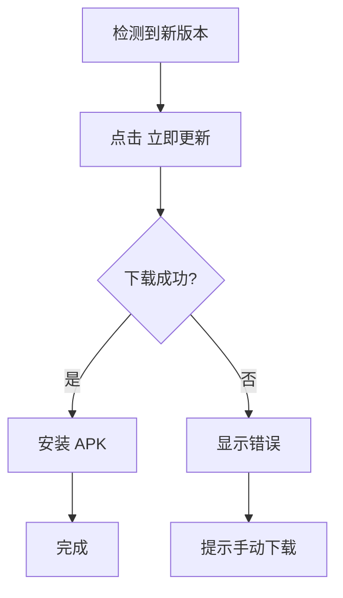
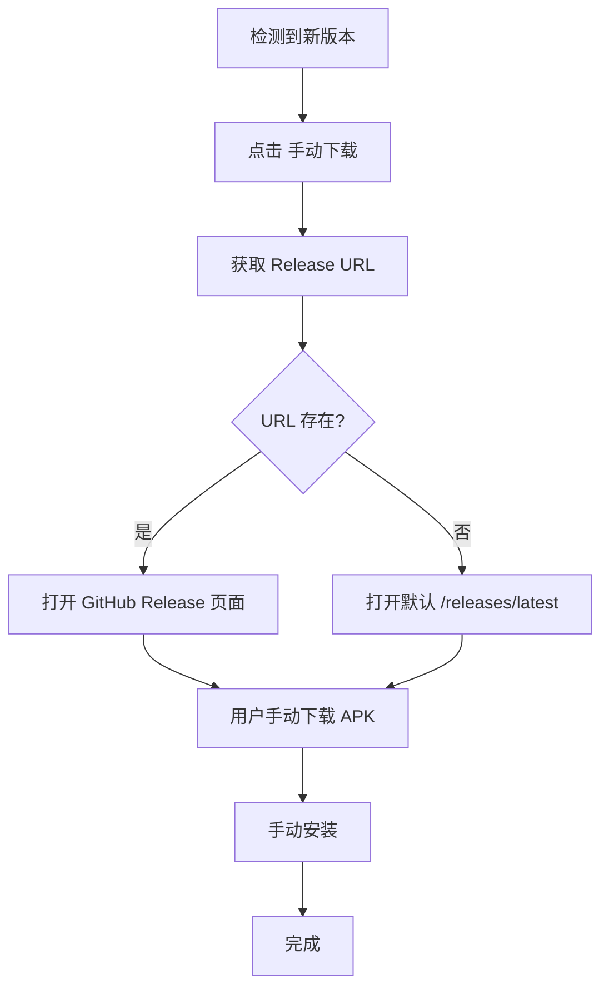

# 📦 手动下载功能实现总结

## 🎯 功能概述

为 Android 应用添加了"手动下载"功能，解决某些设备上自动下载安装失败的问题。用户现在可以直接跳转到 GitHub Release 页面手动下载最新版本。

## ✨ 主要特性

### 1. 双重更新方式

用户在检测到新版本时，可以选择：

| 方式 | 按钮 | 描述 |
|------|------|------|
| **自动更新** | 立即更新 | 应用内自动下载并安装 APK |
| **手动下载** | 手动下载 | 打开 GitHub Release 页面，手动下载安装 |

### 2. 智能链接提取

- 自动从 GitHub Release API 提取 Release 页面链接
- 如果 API 未提供链接，自动回退到 `/releases/latest` 页面
- 确保用户始终能访问到正确的下载页面

### 3. 增强的错误提示

当自动更新失败时，提供清晰的操作指引：

```
如果自动安装失败，您可以：
1. 点击"手动下载"按钮前往 GitHub 下载最新版本
2. 点击"保存到下载文件夹"按钮将安装包保存到下载文件夹后手动安装
```

## 📁 修改文件清单

### 1. `src/hooks/useAppUpdater.ts`

**修改内容：**

#### a) 扩展类型定义
```typescript
export type AndroidUpdateManifest = {
  version: string;
  url: string;
  fileName?: string | null;
  notes?: string | null;
  githubReleaseUrl?: string | null;  // ✨ 新增字段
};
```

#### b) 提取 Release URL
```typescript
function toManifestFromGithubLatestRelease(json: any): AndroidUpdateManifest | null {
  // ...
  const htmlUrl: string | undefined = json.html_url;  // ✨ 提取 Release URL
  // ...
  return {
    version: normalizedVersion,
    url: String(apkAsset.browser_download_url),
    fileName: String(apkAsset.name ?? "") || null,
    notes: (json?.body as string | undefined) ?? null,
    githubReleaseUrl: htmlUrl || null,  // ✨ 保存到 manifest
  };
}
```

#### c) 新增打开外部链接函数
```typescript
export async function openExternalUrl(url: string): Promise<void> {
  try {
    const opener = await import("@tauri-apps/plugin-opener");
    await opener.open(url);
  } catch (error) {
    console.error("[Updater] Failed to open URL via plugin, falling back to window.open", error);
    window.open(url, "_blank");
  }
}
```

**行数变化：** +18 行

### 2. `src/components/Settings.tsx`

**修改内容：**

#### a) 导入新函数
```typescript
import {
  // ...
  openExternalUrl,  // ✨ 新增导入
  type UpdateAvailability,
} from "@/hooks/useAppUpdater";
```

#### b) 新增回调函数
```typescript
const handleOpenGithubRelease = useCallback(async () => {
  if (!availableUpdate || availableUpdate.platform !== "android") return;
  
  const releaseUrl = availableUpdate.manifest.githubReleaseUrl;
  if (!releaseUrl) {
    // Fallback to default GitHub releases page
    const fallbackUrl = "https://github.com/000haoji/arknights-storyteller/releases/latest";
    await openExternalUrl(fallbackUrl);
    return;
  }
  
  await openExternalUrl(releaseUrl);
}, [availableUpdate]);
```

#### c) 添加手动下载按钮
```tsx
{availableUpdate ? (
  <>
    <Button type="button" onClick={handleInstallAppUpdate} disabled={isInstallingUpdate}>
      {/* ... 立即更新按钮 ... */}
    </Button>
    {availableUpdate.platform === "android" && (
      <Button type="button" variant="outline" onClick={handleOpenGithubRelease}>
        <Download className="mr-2 h-4 w-4" />
        手动下载
      </Button>
    )}
  </>
) : null}
```

#### d) 更新错误提示
```typescript
setUpdateMessage(`${errorMessage}\n\n如果自动安装失败，您可以：
1. 点击"手动下载"按钮前往 GitHub 下载最新版本
2. 点击"保存到下载文件夹"按钮将安装包保存到下载文件夹后手动安装`);
```

**行数变化：** +26 行

### 3. 新增文档

- ✅ `arknights-story-reader/ANDROID_UPDATE_ENHANCEMENT.md` - 功能详细说明
- ✅ `VERSION_UPDATE_GUIDE.md` - 更新用户指南
- ✅ `MANUAL_DOWNLOAD_FEATURE.md` - 本文件（开发者参考）

## 🔄 工作流程

### 自动更新流程（原有）



### 手动下载流程（新增）



## 🎨 用户界面变化

### Before（更新前）
```
[ 检查更新 ]  [ 立即更新 ]
```

### After（更新后）
```
[ 检查更新 ]  [ 立即更新 ]  [ 手动下载 ]
```

### 错误状态
```
[ 检查更新 ]  [ 立即更新 ]  [ 手动下载 ]
              [ 保存到下载文件夹 ]
```

## 🧪 测试场景

### ✅ 应该测试的场景

1. **正常流程**
   - [ ] 点击"手动下载"能打开正确的 GitHub Release 页面
   - [ ] Release URL 正确指向当前版本

2. **边缘情况**
   - [ ] API 未返回 `html_url` 时，能回退到默认 URL
   - [ ] opener 插件不可用时，能回退到 `window.open`

3. **用户体验**
   - [ ] 按钮在合适的时机显示/隐藏
   - [ ] 错误提示清晰易懂
   - [ ] 只在 Android 平台显示手动下载按钮

4. **兼容性**
   - [ ] 不影响桌面端的更新流程
   - [ ] 不影响现有的自动更新功能
   - [ ] 向后兼容旧版本的 manifest 格式

## 📊 代码统计

| 文件 | 新增行数 | 修改行数 | 总变化 |
|------|---------|---------|--------|
| `useAppUpdater.ts` | 18 | 3 | 21 |
| `Settings.tsx` | 26 | 4 | 30 |
| **总计** | **44** | **7** | **51** |

## 🚀 部署检查清单

在部署前确保：

- [x] 代码无 TypeScript 错误
- [x] 代码无 ESLint 警告
- [x] 功能文档已完善
- [ ] 在真实 Android 设备上测试
- [ ] 确认 GitHub Release API 返回正确的 `html_url`
- [ ] 测试 opener 插件和 window.open 回退机制

## 🔮 未来改进建议

1. **多源支持**
   - 添加国内镜像源（Gitee、OSS）
   - 让用户选择下载源

2. **下载进度**
   - 显示下载进度条
   - 支持断点续传

3. **版本比较**
   - 详细展示版本差异
   - 高亮新增功能

4. **智能推荐**
   - 根据网络状况自动推荐更新方式
   - 记录用户偏好

## 📝 总结

这次更新通过添加"手动下载"选项，为 Android 用户提供了更可靠的更新途径。特别是在自动安装受限的情况下，用户可以直接访问 GitHub 官方页面下载安装包，提升了更新成功率和用户体验。

**核心优势：**
- ✅ 解决自动安装失败问题
- ✅ 提供官方可信的下载渠道
- ✅ 增强用户控制感
- ✅ 向后兼容，不影响现有功能

---

**相关文档：**
- [ANDROID_UPDATE_ENHANCEMENT.md](arknights-story-reader/ANDROID_UPDATE_ENHANCEMENT.md) - 用户文档
- [VERSION_UPDATE_GUIDE.md](arknights-story-reader/VERSION_UPDATE_GUIDE.md) - 版本管理指南

